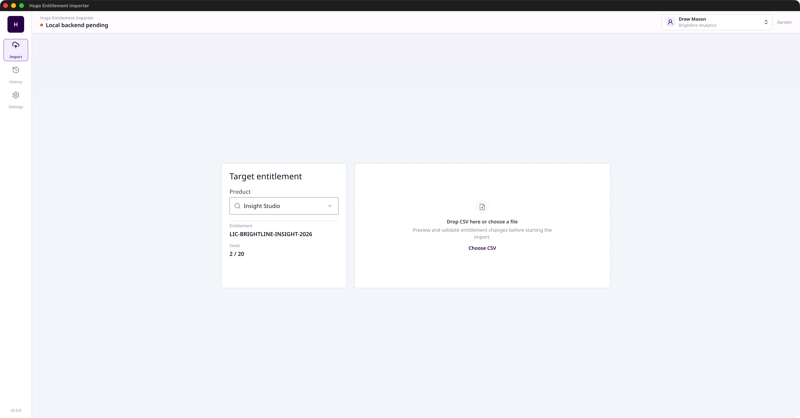
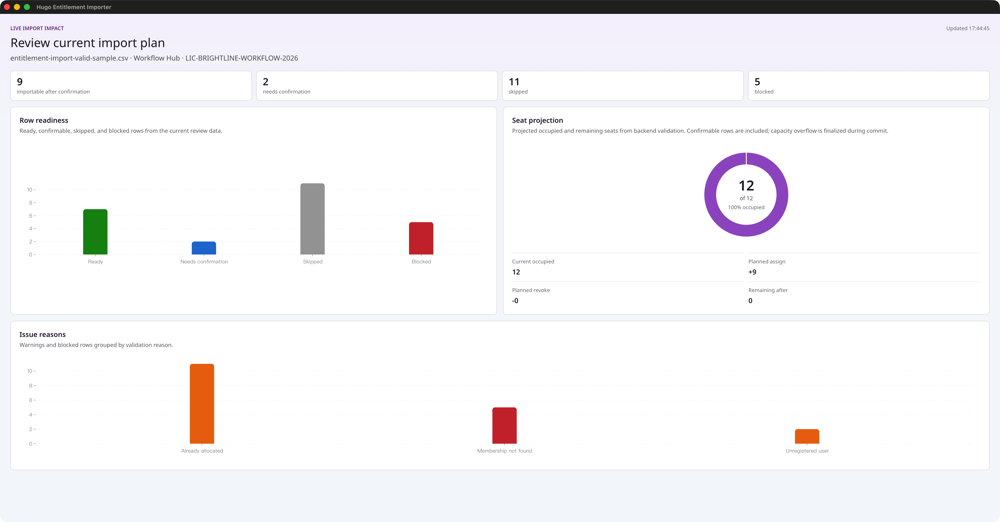
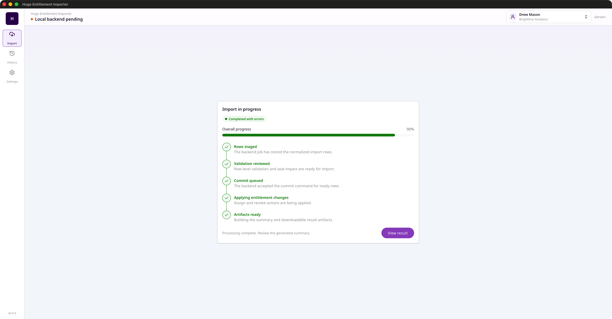
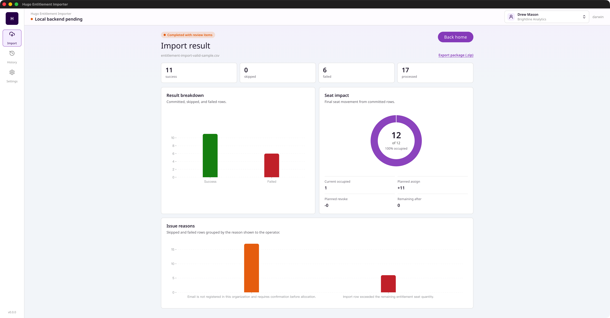
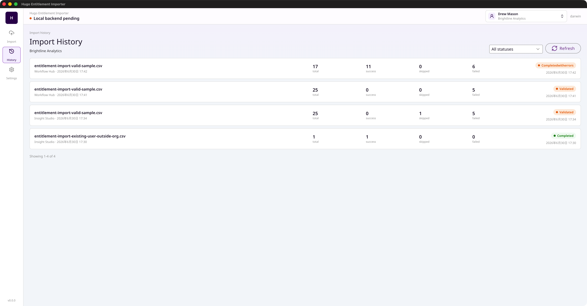

# Hugo Entitlement Importer Desktop

语言：[English](README.md) | 简体中文

SaaS 权益批量导入桌面工具。上传 CSV，校验数据，预览席位占用影响，确认提交后导出结果包。基于 Electron + Vue 3 开发。

## 截图

上传 CSV、修复校验问题，提交前查看影响：

| 上传 & 校验 | 影响预览 | 导入进度 |
| --- | --- | --- |
|  |  |  |

| 导入结果 | 历史记录 |
| --- | --- |
|  |  |

## 依赖

本应用是前端客户端，本地运行需要另外两个相关项目：

- **后端**：[HugoHZXu/hugo-saas-backend](https://github.com/HugoHZXu/hugo-saas-backend) — 提供权益、身份和导入 API
- **UI 组件库**：[HugoHZXu/hugo-ui](https://github.com/HugoHZXu/hugo-ui) — `@hugo-ui/shadcn-vue` 包，通过 `.npmrc` 配置的本地 registry 链接

## 技术栈

Electron、Vue 3、TypeScript、Vite（搭配 electron-vite）、Pinia、vue-i18n、AntV G2、Vitest、pnpm workspace。

## 文档

- [打包说明](docs/packaging.zh-CN.md)（[English](docs/packaging.md)）

## 本地开发

前置条件：

- Node.js `>=22.13.0`
- pnpm `>=11.9.0 <12`
- 从 [HugoHZXu/hugo-ui](https://github.com/HugoHZXu/hugo-ui) 本地构建并可用的 `@hugo-ui/shadcn-vue`
- 本地运行的 [HugoHZXu/hugo-saas-backend](https://github.com/HugoHZXu/hugo-saas-backend) 后端服务

后端服务地址可通过环境变量覆盖：

| 服务 | 默认地址 | 环境变量 |
| --- | --- | --- |
| Entitlement REST API | `http://127.0.0.1:4317` | `VITE_ENTITLEMENT_REST_URL` 或 `VITE_BACKEND_URL` |
| Entitlement GraphQL API | `http://127.0.0.1:4317/graphql` | `VITE_ENTITLEMENT_GRAPHQL_URL` |
| Identity service | `http://127.0.0.1:4320` | `VITE_IDENTITY_SERVICE_URL` |

安装依赖并启动开发环境：

```bash
pnpm install
pnpm dev
```

`pnpm dev` 会启动 Vite 开发服务器并打开 Electron 窗口。其他常用命令：

```bash
pnpm test      # 运行 Vitest 测试
pnpm build     # 类型检查并构建所有包
```

## 导入流程

1. 使用身份账号登录，选择需要管理的权益组织
2. 应用自动加载该组织下可用的产品和权益
3. 上传 CSV 文件，在本地完成解析
4. **本地校验**快速拦截明显问题：缺失邮箱、邮箱格式错误、无法识别的操作类型、重复邮箱、同一邮箱冲突操作
5. 创建后端导入任务，触发服务端校验，检查项包括：
   - 邮箱是否已在 SaaS 账号系统中注册
   - 已注册用户是否为当前组织成员
   - 权益状态（例如权益是否激活、`revoke` 操作是否已有分配记录等）
   - 导入后是否会超出席位数量限制
6. 在表格中查看合并后的校验结果，可以编辑行、删除问题行或跳过警告
7. 提交前可在独立窗口中查看席位占用影响图表
8. 确认提交后，应用轮询直到任务处理完成
9. 导出结果包（.zip），包含 XLSX 汇总报告以及成功/失败明细 CSV

### 角色权限与用户处理

导入时对用户的处理方式取决于你在组织中的角色：

- **组织管理员**（拥有组织成员管理权限）：
  - **未注册用户**：确认后会在账号系统中创建账号，状态设置为 `Incomplete`，加入当前组织并分配席位
  - **已注册但不在组织内的用户**：确认后会将其加入当前组织并分配权益

- **仅权益管理员**（仅有权益分配权限，无组织成员管理权限）：
  - **未注册用户**：无法导入——你没有创建账号的权限，这类行会被标记为阻断
  - **已注册但不在组织内的用户**：无法导入——你没有将用户加入组织的权限，这类行会被标记为阻断

因权限不足无法导入的行会被标记为阻断状态，提交前必须删除或跳过这些行。

## CSV 格式

| 列名 | 必填 | 说明 |
| --- | --- | --- |
| `email` | 是 | 会去除首尾空格并转为小写用于重复检测 |
| `name` | 否 | 去除首尾空格后透传给后端 |
| `department` | 否 | 去除首尾空格后透传给后端 |
| `action` | 否 | `assign`（空值默认）或 `revoke` |

示例 CSV 文件在 `test-data/` 目录下。

## 架构说明

- 采用 pnpm monorepo 结构，包含三个包：`web/`（Vue 渲染层）、`electron/`（主进程 + preload）、`charts/`（共享 G2 图表组件）
- 影响预览图表在独立 Electron 窗口中打开。图表数据通过 IPC 发送；窗口加载完成后会主动重新请求最新数据，保证刷新或重新打开时状态一致
- 开发模式下 Electron 加载 Vite 开发服务器地址；生产环境下从 `web/dist` 加载构建后的文件

## 许可证

MIT
