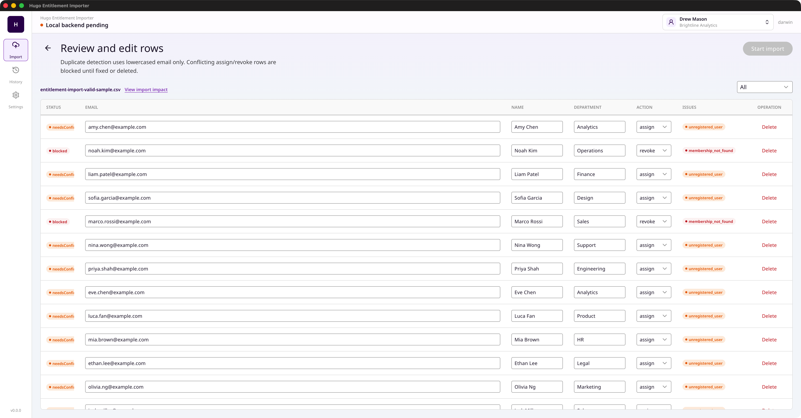

# Hugo Entitlement Importer Desktop

[English README](../README.md)

Hugo Entitlement Importer Desktop 是一个用于 Portfolio 展示的 Electron 桌面应用，场景是 SaaS 权益管理中的批量权益导入。它覆盖 CSV 上传、导入校验、影响分析、导入进度、结果查看、历史记录和图表汇总等流程。

这个仓库的目标是展示产品工程、前端架构、桌面端集成和 UI 实现能力。它不是一个开箱即用的商业交付产品，也不包含安装包发布流程。

## 截图

| 导入 | 校验 | 进度 |
| --- | --- | --- |
|  |  |  |

| 影响分析 | 导入结果 | 历史记录 |
| --- | --- | --- |
|  |  |  |

## 项目展示点

- 基于 Electron 的桌面端外壳和 Vue 渲染层。
- 批量 CSV 导入流程，包括校验、复核、提交、结果和历史状态。
- 面向 SaaS 管理后台的产品、权益和组织数据建模。
- 围绕导入复核和席位占用数据的图表看板。
- 基于 `vue-i18n` 的中英文界面文案。
- 类型化 API client、Pinia store，以及针对导入核心逻辑的 Vitest 测试。

## 相关仓库

- 后端仓库：[HugoHZXu/hugo-saas-backend](https://github.com/HugoHZXu/hugo-saas-backend)
- UI 组件仓库：[HugoHZXu/hugo-ui](https://github.com/HugoHZXu/hugo-ui)

本应用依赖 `hugo-saas-backend` 中的权益、身份和导入相关服务。

UI 组件来自 `hugo-ui` 中维护的 `@hugo-ui/shadcn-vue`。本仓库保留了这个本地 npm 包依赖，并通过 `.npmrc` 指向本地 registry，因此不预期读者在没有本地 UI 包环境的情况下直接 clone 后完成安装。

## 技术栈

- Electron
- Vue 3
- TypeScript
- Vite 和 electron-vite
- Pinia
- vue-i18n
- AntV G2
- Vitest
- pnpm workspace

## 本地后端假设

默认情况下，桌面应用会访问本地后端服务：

| 服务 | 默认地址 | 覆盖方式 |
| --- | --- | --- |
| Entitlement REST API | `http://127.0.0.1:4317` | `VITE_ENTITLEMENT_REST_URL` 或 `VITE_BACKEND_URL` |
| Entitlement GraphQL API | `http://127.0.0.1:4317/graphql` | `VITE_ENTITLEMENT_GRAPHQL_URL` |
| Identity service | `http://127.0.0.1:4320` | `VITE_IDENTITY_SERVICE_URL` |

后端部分见 [HugoHZXu/hugo-saas-backend](https://github.com/HugoHZXu/hugo-saas-backend)。

## 本地开发说明

前置条件：

- Node.js `>=22.13.0`
- pnpm `>=11.9.0 <12`
- 本地可用的 `@hugo-ui/shadcn-vue`，来源于 [HugoHZXu/hugo-ui](https://github.com/HugoHZXu/hugo-ui)
- 本地运行的后端服务，来源于 [HugoHZXu/hugo-saas-backend](https://github.com/HugoHZXu/hugo-saas-backend)

常用脚本：

```bash
pnpm test
pnpm build
pnpm dev
```

`pnpm build` 会执行类型检查、构建 charts 包、构建 web 渲染层，并构建 Electron main/preload 输出。本仓库不包含 CI、安装包打包或 GitHub Release 自动化，因为它的定位是 Portfolio 代码仓库，而不是正式分发的桌面端产品。

## 目录结构

```text
packages/
  charts/     共享图表组件和图表数据类型。
  electron/   Electron main 和 preload 进程。
  web/        Vue 渲染层应用。
docs/images/  README 使用的 Portfolio 截图。
test-data/    导入场景示例 CSV 文件。
```

## 许可证

MIT
